# Service Platform

* [Como configurar](#como-configurar)
* [Regras](#regras)
	* [Branches](#branches)
	* [Commits](#commits)
	* [Comandos git](#comandos-git)

# Como configurar:

 1. Java SDK 17 - (Eu recomendo o [Amazon Corretto](https://aws.amazon.com/pt/corretto))
 2. PostgreSQL - [PostgreSQL Version 14.2](https://www.enterprisedb.com/downloads/postgres-postgresql-downloads)
 3. pgAdmin - [pgAdmin 4](https://www.pgadmin.org/download/)
 4. Postman - [Postman](https://www.postman.com/downloads/)

<!-- Baixe tudo por aqui - [Google Drive](https://drive.google.com/drive/folders/1yLczmXNYp7ogYl5ozSot4wauF0vo5m1q?usp=sharing) -->
#### Como configurar: 

 1. Instale o PostgreSQL
 2. Crie dois Bancos de dados no pgAdmin (um para o customer-base e outro para records):
		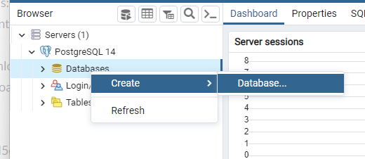
		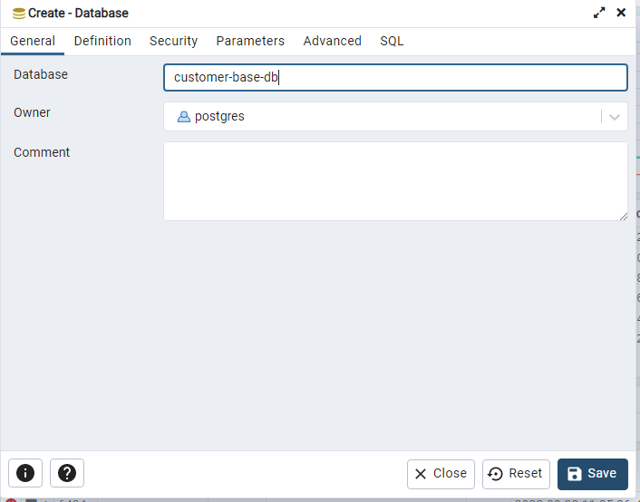
 3. Para cada projeto, crie as variáveis de ambiente. Vá até o menu Rum > Edit Configurations:
		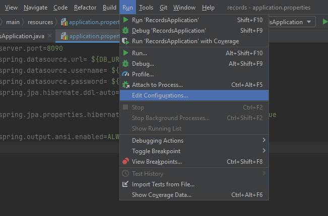
 4. Vá até Environment variables e clique no botão na direita para editar:
		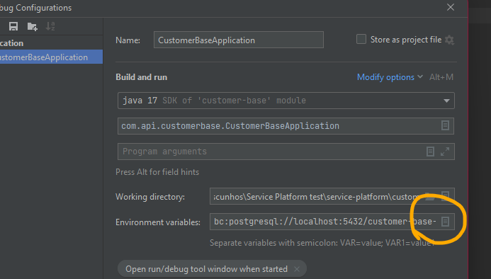
 5. Coloque o nome das variáveis de ambiente de acordo com os nomes em application.properties
		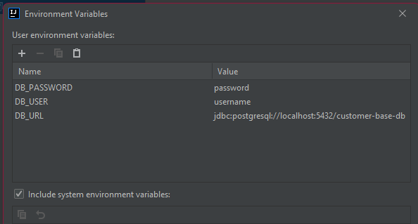
 6. Os valores devem corresponder ao banco de dados:
		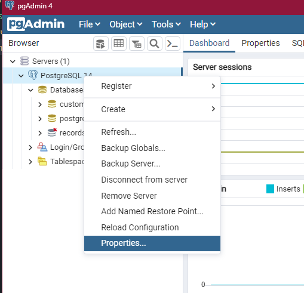
		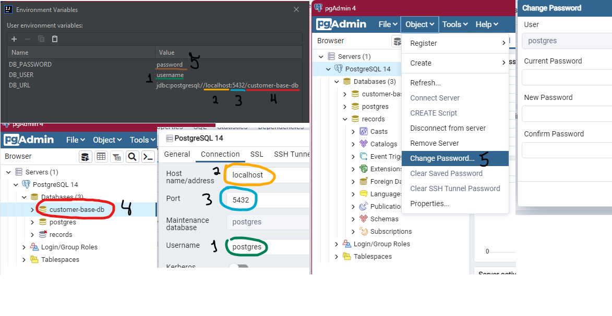
 7. Importe as collections para o Postman:
		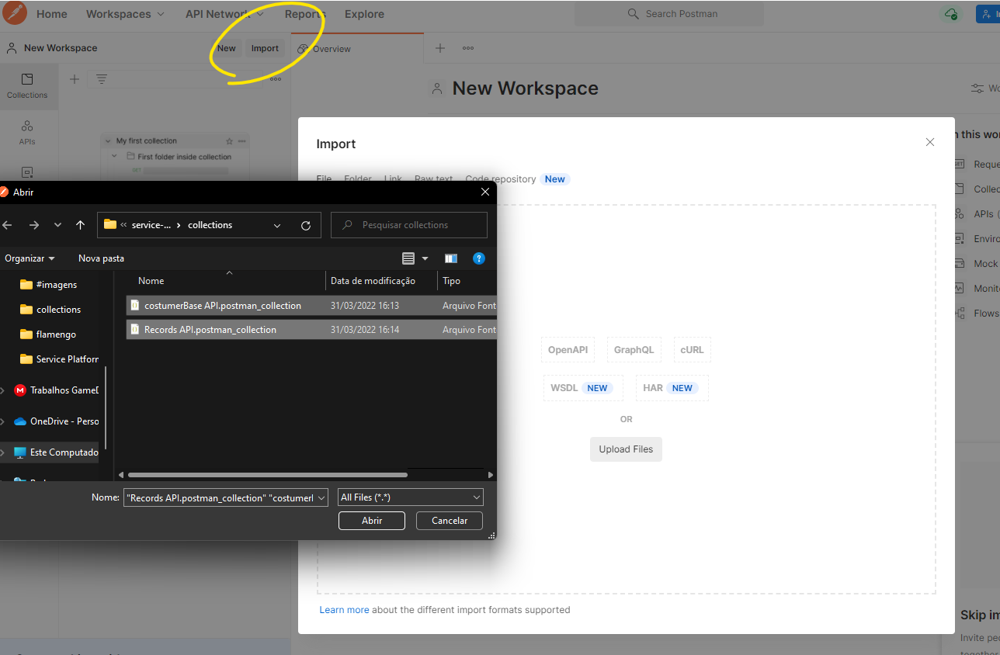
        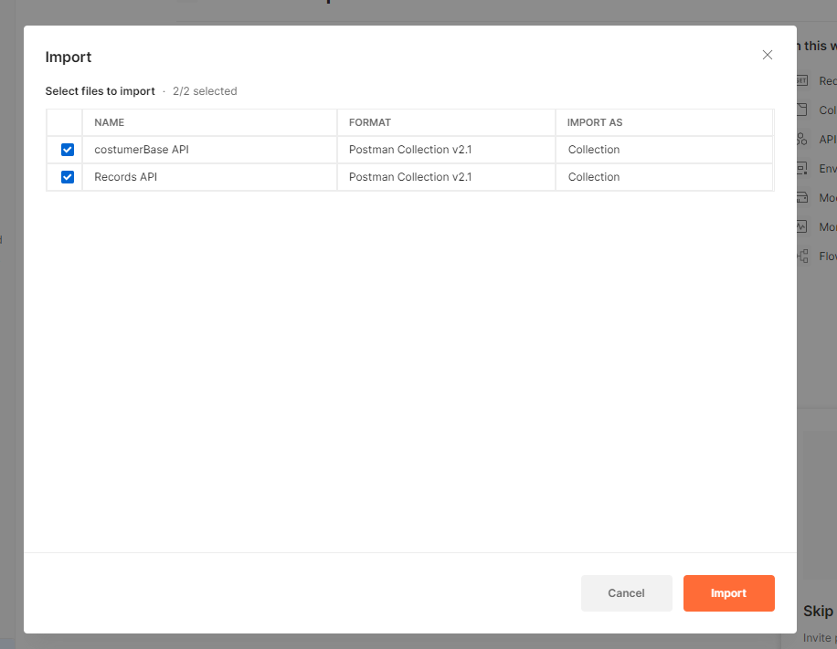
 8. Agora pode rodar ambos os projetos, as requisições podem ser feitas no Postman todas as queries estão nos collections importados.
        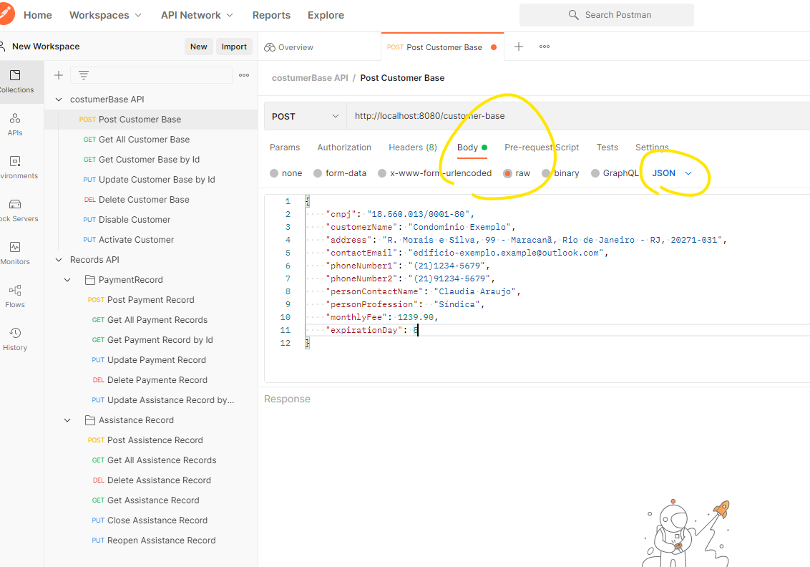
        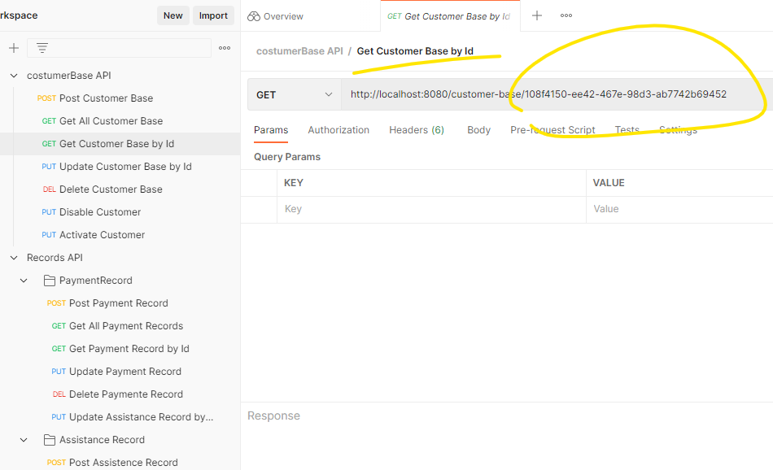


# Regras:

**Temos algumas regras para manter o projeto organizado, prevenir que bugs sejam gerados e se tornem uma "bola de neve".**

## Branches

- A branch main deve possui apenas as versões finais de uma feature
- Trabalhe novas features em uma branch separada.
- Além da main, o projeto seguirá com 2 branches principais para trabalhar novas funcionalidades, uma para o front-end, outra para o back-end. Durante o desenvolvimento surgirão outras branches caso seja necessário.
- Caso queira implementar uma nova funcionalidade que tem potencial para quebrar todo o código ou caso queira testar algo que possivelmente será deletado, crie uma nova branch a partir da branch em que está trabalhando:
	1. A partir da branch em que está trabalhando, crie uma nova branch exemplo "git checkout -b new-feature"
	2. Trabalhe essas features nessa branch
	3. Após garantir que tudo está funcinonando, volte para a branch onde estava trabalhando e faça um merge com new-feature

## Commits

- Seja o commit pra incrementar algo ou para corrigir um trecho de código, não mexa em outros trechos de código que não tenham relação direta em um mesmo commit. Casa necessário faça em commits separados.
- Evite mexer em funcionalidades de contextos diferentes em um mesmo commit. (Essa pratica dificulta muito na hora de identificar em qual commit um bug foi adicionado por exemplo.)

## Comandos git

**Criar uma nova branch e mudar pra ela:**

```git
git checkout -b my-branch
```	
<br>

**Enviar as atualizações locais para a branch remota e cria-la caso ela não exista remotamente. (Não use esse comando na branch main):**
```git
git push origin my-branch
```
<br>

**Baixar para branch local as atualizações da branch remota:**
```git
git pull origin my-branch
```
<br>

**Baixar para uma branch local as atualizações da branch main remota:**
```git
git checkout my-branch
git pull origin main --rebase
```
Agora atualize a branch remota com o comando:
```git
git push origin my-branch --force
```
<br>

**Atualizar a branch main remota com as ultimas features trabalhadas:**
> Atenção: Use apenas quando todas as features tiverem sido devidamente testadas
```git
git checkout main
git pull origin main
git merge my-branch
git push origin main
```
	
