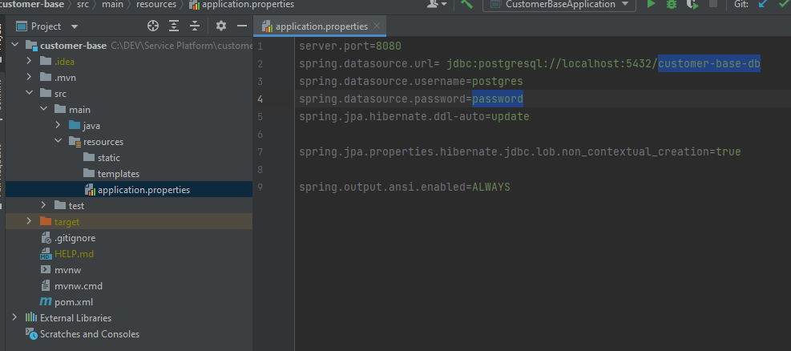

# Service Platform

#### Necessário para rodar:

 1. Java SDK 17 - (Eu recomendo o [Amazon Corretto](https://aws.amazon.com/pt/corretto))
 2. PostgreSQL - [PostgreSQL Version 14.2](https://www.enterprisedb.com/downloads/postgres-postgresql-downloads)
 3. pgAdmin - [pgAdmin 4](https://www.pgadmin.org/download/)
 4. Postman - [Postman](https://www.postman.com/downloads/)

Baixe tudo por aqui - [Google Drive](https://drive.google.com/drive/folders/1yLczmXNYp7ogYl5ozSot4wauF0vo5m1q?usp=sharing)
#### Como configurar: 

 1. Instale o PostgreSQL
 2. Crie dois Bancos de dados no pgAdmin (um para o customer-base e outro para records):
		
		
 3. Em ambos os projetos, dentro da pasta main>resources, altere o arquivo application.properties e configure o caminho do banco de dados e a senha:
		
 4. Importe as collections para o Postman:
		
        
 5. Agora pode rodar ambos os projetos, as requisições podem ser feitas no Postman todas as queries estão nos collections importados.
        
        

    
